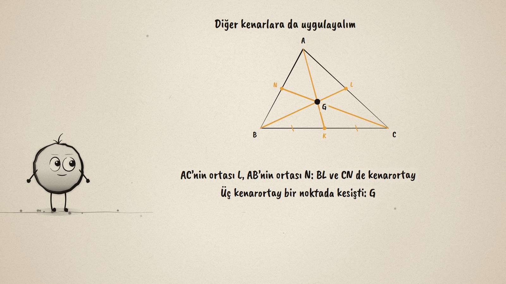
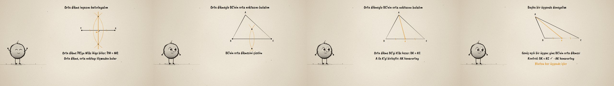

# Kenarortayı Çiz · Constructing a Median

**▶ Tarayıcıda izleyin / Watch in the browser:** https://hakanatas.github.io/kenarortayi-ciz/ 
**⬇ MP4 + altyazılar / MP4 + subtitles:** [Releases](https://github.com/hakanatas/kenarortayi-ciz/releases) 
**✎ Kullanılan istem / The prompt behind it:** [PROMPT.md](PROMPT.md) 
**🎞 Bütün filmler / All films:** [Nokta'nın Filmleri](https://hakanatas.github.io/nokta-filmleri/?sinif=7)

> **TR —** 7. sınıf matematik "Geometrik Şekiller" temasındaki MAT.7.5.2 öğrenme çıktısı için hazırlanmış, tamamen JavaScript ile çizilen 92 saniyelik mürekkep animasyonu. A köşesinden BC kenarına kenarortay çizmek için BC'nin orta noktası gerekiyor: ölçmeden bulunabilir mi? Önce orta dikme inşası hatırlanıyor: P ve Q merkezli eşit yaylar iki noktada kesişiyor, bu noktaları birleştiren doğru PQ'yu M'de ikiye bölüyor. Aynı adımlar üçgenin BC kenarına uygulanıyor: orta dikme BC'yi K'de kesiyor (BK = KC) ve A ile K birleştirilince kenarortay AK çıkıyor. Yöntem diğer kenarlara da uygulanıyor: L ve N orta noktaları, BL ve CN kenarortayları; üç kenarortay G noktasında kesişiyor. Son olarak geniş açılı bir üçgende aynı inşa yapılıp kontrol ediliyor. Altyazılar Türkçe, İngilizce ya da ikisi birlikte seçilebilir.

A 92-second ink animation for **7th-grade maths**. Nokta, the ink character from [The Learning Ink](https://github.com/hakanatas/the-learning-ink), is the guide again. The construction is the `perpBis` function from the earlier film on perpendicular bisectors, reused unchanged in `scenes/scene1.js`: called on a lone segment it recalls the method, called on each side of a triangle it finds the midpoints that the medians need.

## Learning outcome

MEB, Türkiye Yüzyılı Maarif Modeli, Ortaokul Matematik, 7th grade, "Geometrik Şekiller" theme:

**MAT.7.5.2. Orta dikme inşasına yönelik deneyimlerini üçgende kenarortay inşasına yansıtabilme**
- a) Orta dikme inşasına yönelik deneyimlerini gözden geçirir.
- b) Üçgende kenarortay inşasına yönelik çıkarım yapar.
- c) Çıkarımını farklı örnekler üzerinden değerlendirir.

## Scenes

| # | Time | Scene | What happens | Outcome |
|---|---|---|---|---|
| 1 | 0–10 s | Üçgen | A median from A needs the midpoint of BC. | – |
| 2 | 10–28 s | Orta dikme | Equal arcs from P and Q; the bisector halves PQ at M. | a |
| 3 | 28–46 s | Kenarortay | The bisector of BC meets it at K (BK = KC); AK is the median. | b |
| 4 | 46–64 s | Üç kenarortay | The same on AC and AB gives L and N; the three medians meet at G. | c |
| 5 | 64–80 s | Başka üçgen | An obtuse triangle: the construction works again. | c |
| 6 | 80–92 s | Aklında kalsın | Bisect the side, join the midpoint to the opposite vertex. | a–c |

## Running it

- **Preview:** double-click `index.html` (it works offline).
- **MP4:** run `npm install` once, then `npm run export -- --format=horizontal --captions=tr`.
- **Subtitles and narration:** `npm run srt` writes `out/captions_*.srt` and `narration_notes.txt`.
- **Editing:**
  - Caption text, timings and narration notes: `captions.js`
  - Everything on screen is drawn by `LI.world(t)` in `scenes/scene1.js` (the triangles, the arcs, the medians, the words); the other scenes only set the camera.
  - Nokta's poses: `src/draw/film.js`; layout for 16:9 and 9:16: `src/draw/kd.js`

It uses the same engine as The Learning Ink: `renderFrame(t)` as a pure function of time, seeded randomness, and frame-by-frame export.

## Lisans · License

**TR —** Bu film ve kodu [Creative Commons Atıf-GayriTicari 4.0 Uluslararası (CC BY-NC 4.0)](https://creativecommons.org/licenses/by-nc/4.0/deed.tr) lisansıyla paylaşılır. Ticari olmayan her amaçla (derste, okulda, eğitim materyalinde) kopyalayabilir, paylaşabilir ve değiştirebilirsiniz; ancak **kaynak göstermek zorunludur**: eser sahibinin adı ve bu deponun bağlantısı belirtilmeden kullanılamaz. Ticari kullanım (satış, ücretli ürün ya da yayın) için izin alınmalıdır.

**EN —** This film and its code are licensed under [Creative Commons Attribution-NonCommercial 4.0 International (CC BY-NC 4.0)](https://creativecommons.org/licenses/by-nc/4.0/). You may copy, share and adapt them for non-commercial purposes, but **attribution is required**: they may not be used without crediting the author and linking to this repository. Commercial use requires permission.

Atıf örneği / Required credit: *“Kenarortayı Çiz”, Hakan Ataş, Nokta'nın Filmleri — https://github.com/hakanatas/kenarortayi-ciz — CC BY-NC 4.0*
